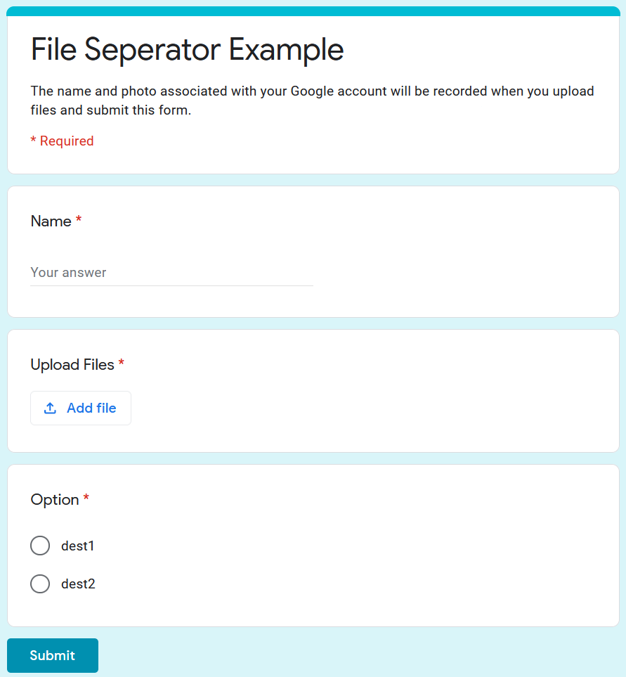

# Google Apps Script

Google Apps Script to automate and customise Google Apps such as Forms, Sheets etc.

## How to add Google Apps Script to your Google Forms.
- At the top-right corner tap on three dot menu and select **<> Script editor**.
- Once open you can now write Script to automate your tasks
- You can add triggers and custom function to automate your tasks
- You may need to authanticate before you can run a script on an App

1. Seperate Google Form Response files in different folders.
    If you have a Google Form with file upload and you want your files to automatically be sorted into sepcific folder based on response. You can use [this script](FormToFolder.gs). This script is written for the following example. 

    

    You can add more complex operations to categorize files. 

**Do not forget to star if this saved you a fortune. More Scripts to come soon :)** 